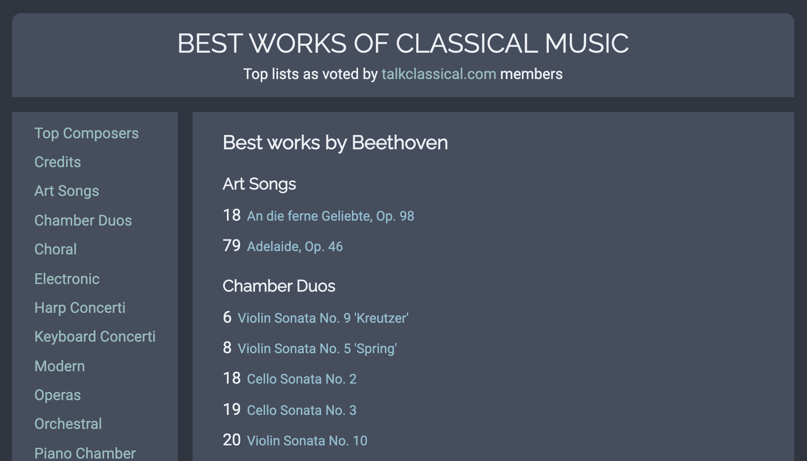

# Lists of classical music works

As recommended by TalkClassical forum members.

An exercise in making traditional website using Clojure for everything, including
- HTML ([hiccup](https://github.com/weavejester/hiccup))
- CSS ([garden](https://github.com/noprompt/garden))
- SQL ([honeysql](https://github.com/seancorfield/honeysql))

SQLite is used for data storage.

See live: https://tclist.best

## How to run

### Docker

- `$ docker-compose up -d`
- Open `http://localhost:7888/`

### Native

- Have [leiningen](https://leiningen.org) and [Clojure](https://clojure.org) installed;
- `$ lein run`
- Open `http://localhost:7888/`

## Tests

TODO

## Deploy

TODO